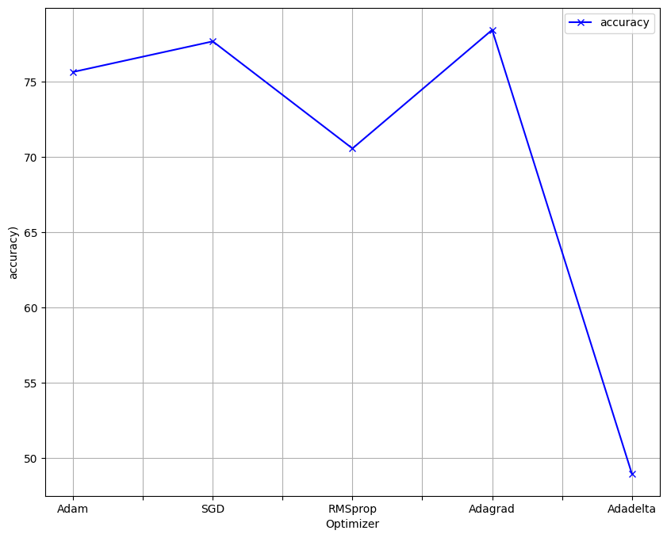

# Brain Tumor Project

## Brief Description

This project is a Test of Large Pre Trained Models (PTMs) : VGG16 & EfficientNetB7 models to comprehensively address the Brain Tumor segmentation procedure. I compare the Two and Curate a simple Web application to allow a Medical Practitioner client to use the most efficent model or choose either for the matter

## Abstract

A brain tumor is regarded as a highly aggressive ailment affecting both children and adults. It constitutes 85 to 90 percent of all primary tumors in the central nervous system (CNS). Annually, approximately 11,700 individuals receive a brain tumor diagnosis. The 5-year survival rates for cancerous brain or CNS tumors are around 34 percent for men and 36 percent for women. Brain tumors can be categorized as benign, malignant, or pituitary tumors. To enhance the life expectancy of patients, it is crucial to implement appropriate treatment, planning, and precise diagnostics. Magnetic Resonance Imaging (MRI) is the most effective method for detecting brain tumors, generating a vast amount of image data. These images are examined by radiologists. However, manual examination is prone to errors due to the complexities associated with brain tumors and their properties. The application of automated classification techniques, such as Machine Learning (ML) and Artificial Intelligence (AI), has consistently demonstrated higher accuracy compared to manual classification. Therefore, proposing a system that utilizes Deep Learning Algorithms, specifically Convolutional Neural Networks (CNN), Artificial Neural Networks (ANN), and Transfer Learning (TL), to perform detection and classification would be beneficial for doctors worldwide.

## Context

Brain Tumors are complex. There are a lot of abnormalities in the sizes and location of the brain tumor(s). This makes it really difficult for complete understanding of the nature of the tumor. Also, a professional Neurosurgeon is required for MRI analysis. Often times in developing countries the lack of skillful doctors and lack of knowledge about tumors makes it really challenging and time-consuming to generate reports from MRI’. So an automated system on Cloud can solve this problem.

## Definition

To Detect and Classify Brain Tumor using, CNN and TL; as an asset of Deep Learning and to examine the tumor position(segmentation).

# The DataSet

The Dataset folder contains MRI data. The images are already split into Training,Testing and Validation folders.
Each folder has more four subfolders. These folders have MRIs of respective tumor classes.
The Dataset was download from kaggle, and it is publicly available and has no use restriction.

## Acknowledgements for Dataset.

1. Navoneel Chakrabarty
2. Swati Kanchan
3. Masoud Nickparvar 

Download the dataset from [Kaggle](https://www.kaggle.com/sartajbhuvaji/brain-tumor-classification-mri).
Download the Validation Dataset from [kaggle](https://www.kaggle.com/datasets/masoudnickparvar/brain-tumor-mri-dataset)

## Requirements

Minimum Machine Specifications

| **Requirement**        |   **Description**                                   |
| ---------------------- |  -------------------------------------------------- |
| `Google Colab`         |Select the GPU/TPU runtime - Colab Pro is recommended|

_A Glimpse of the data_

| **Image**              |   |[sc](/images/meningioma.jpg) ||  |
| ---------------------- |------------------------------|-----------------------------|----------------------------|-----------------------------|
| **Description**        |Glioma                        |Meningioma                   |Pituitary                   |No Tumor                     |

_Pre-Processing of the data_

The images where transformed in the following manner

| **Transformation**               |   **OutPut**                                     |
| -------------------------------- |  ----------------------------------------------- |
| Original Image                   |           |
| horizontal flipping              |         |
| vertical flipping                |           |
| zooming at 0.2                   |               |
| rotation at 20 degrees           |           |
| featurewise_std_normalization    |        |
| shear-range of 0.2               |              |
| brightening at the range 0.2-1.5 |         |
| width shift range of 0.1         |              |
| height shift range of 0.1        |             |

**2. Model Development and Fine-tuning**

The following parameters namely: Batch size, Epochs, Dropout and Optimizer, of the model where fined, and the visualisation of the results are below

The following values and parameters where chosen:

- **_Optimizers_** -  Five optimizers have been chosen , namely ; `1. SGD,2. RMSprop,3. Adam,4. Adagrad,5. Adadelta.` the best optimizer will be used in the New model and as step 1 for the webapp

- **_Number of epochs_** - Epochs variation ; `1, 2, 5, 10.`

- **_Batch size_** - Batch size variation; `8, 16.`

- **_Dropout_** - Drop out values by order  `0.5, 0.6, 0.7, 0.8, 0.9`

#### EfficientNetB7 - Batch size and Epochs

       

#### VGG16 - Batch size and Epochs

#### EfficientNetB7 - Dropout

#### VGG16 - Dropout

#### EfficientNetB7 - Optimizer

#### VGG16 - Optimizer

**3. Final Model Implementation(s) and Results**

This is the structure of the EfficientNetB7 model implemented with optimum parameters, similarly with the VGG16 model.

#### EfficientNetB7 model

| **Parameter**          |   **Optimal values**      |
| ---------------------- |-------------------------- |
|`Optimizer`             |`Adagrad`                  |
|`Dropout_rate `         |`0.6`                      |
|`Batch size `           |`16`                       |
|`Epochs `               |`10`                       |

#### VGG16 model

| **Parameter**          |   **Optimal values**      |
| ---------------------- |-------------------------- |
|`Optimizer`             |`Adagrad`                  |
|`Dropout_rate `         |`0.5`                      |
|`Batch size `           |`16`                       |
|`Epochs `               |`10`                       |

**4. Conclusions**

After comparing VGG16 and EfficientNetB7, The results are as below : 

| **Requirement(%)**     |   **Accuracy (%)**        |  **Validation Accuracy (%)** |
| ---------------------- |-------------------------- |------------------------------|
| `EfficientNetB7`       |  97.76                    | 97.17                       |
| `VGG16 `               |  96.34                    | 78/17                        |

Therefore, the most efficient model is `EfficientNetB7` after a Training of 5 hours

## Web Application

#### Home Page

#### Classification Results via Web Interface

### Classifier Evaluation

#### Loss Graph

#### Accuracy Graph

#### Confusion Matrix on Test set

#### Library Requirements

I will be using the following libraries to complete The classification problem:

* **Numpy** - For linear algebra operations
* **Torch** - Pytorch Deep Learning Framework
* **OS** - To use Operating System methods
* **Random** - To set random seed at specific places where random operations take place just so it happens the same way everytime it is executed
* **Pandas** - To create DataFrame, CSV files, etc
* **Time** - To perform date time operations
* **Seaborn** - For sophisticated visualization
* **Pickle** - To save and load binary files of our training data
* **Scikit-Learn** - Machine learning framework. We have used this for evaluating our Classifier and for cross-validation split
* **Matplotlib** - To visualize images, losses and accuracy
* **Google Colab Drive** - To mount Google Drive so we can perform storage and loading operations using it (Only available on Google Colab)

The above mentioned libraries comes pre-installed and pre-configured with Google Colab.

Install the required libraries on your computer using the [pip](https://pip.pypa.io/en/stable/) package manager.

For pip version 19.1 or above:

~~~bash
pip install -r requirements.txt --user
~~~