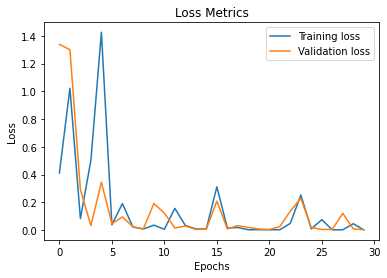
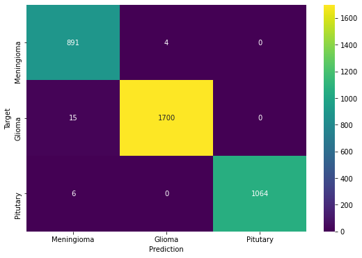

# Brain Tumor Project

## Brief Description

This project is a combination of Manually Trained and pretrained VGG16, Google's LeNET & EfficientNetB7 models to comprehensively address the Brain Tumor segmentation procedure. I compare the Two main widely implemented models : VGG16 & EfficientNetModel7 and Curate a simple web application to allow the Medical Practitioner client to use the most efficent model or choose either for the matter

## Abstract

A Brain tumor is considered as one of the aggressive diseases, among children and adults. Brain tumors account for 85 to 90 percent of all primary Central Nervous System(CNS) tumors. Every year, around 11,700 people are diagnosed with a brain tumor. The 5-year survival rate for people with a cancerous brain or CNS tumor is approximately 34 percent for men and36 percent for women. Brain Tumors are classified as: Benign Tumor, Malignant Tumor, Pituitary Tumor, etc. Proper treatment, planning, and accurate diagnostics should be implemented to improve the life expectancy of the patients. The best technique to detect brain tumors is Magnetic Resonance Imaging (MRI). A huge amount of image data is generated through the scans. These images are examined by the radiologist. A manual examination can be error-prone due to the level of complexities involved in brain tumors and their properties.Application of automated classification techniques using Machine Learning(ML) and Artificial Intelligence(AI)has consistently shown higher accuracy than manual classification. Hence, proposing a system performing detection and classification by using Deep Learning Algorithms using Convolution-Neural Network (CNN), Artificial Neural Network (ANN), and Transfer-Learning (TL) would be helpful to doctors all around the world.

## Context
Brain Tumors are complex. There are a lot of abnormalities in the sizes and location of the brain tumor(s). This makes it really difficult for complete understanding of the nature of the tumor. Also, a professional Neurosurgeon is required for MRI analysis. Often times in developing countries the lack of skillful doctors and lack of knowledge about tumors makes it really challenging and time-consuming to generate reports from MRI’. So an automated system on Cloud can solve this problem.

## Definition

To Detect and Classify Brain Tumor using, CNN and TL; as an asset of Deep Learning and to examine the tumor position(segmentation).

# The Data-Set

The Dataset folder contains MRI data. The images are already split into Training and Testing folders.
Each folder has more four subfolders. These folders have MRIs of respective tumor classes.
The Dataset was download from kaggle, and it is publicly available and has no use restriction.

## Acknowledgements for Dataset.

1. Navoneel Chakrabarty
2. Swati Kanchan
3. Masoud Nickparvar 

Download the dataset from [Kaggle](https://www.kaggle.com/sartajbhuvaji/brain-tumor-classification-mri).
DOwnload the Validation Dataset from [kaggle2] (https://www.kaggle.com/datasets/masoudnickparvar/brain-tumor-mri-dataset)

## Requirements

Minimum Machine Specifications

| **Requirement**   |   **Description**                                        |
| ---------------------- |  -------------------------------------------------- |
| `Google Colab    `     |Select the GPU runtime and select the package; Free  |

_A Glimpse of the data_

_Pre-Processing of the data_

The images where transformed in the following manner

| **Transformation**               |   **OutPut**                                     |
| -------------------------------- |  ----------------------------------------------- |
| Original Image                   |    |
| horizontal flipping              |  |
| vertical flipping                |    |
| zooming at 0.2                   |        |
| rotation at 20 degrees           |    |
| featurewise_std_normalization    | |
| shear-range of 0.2               |       |
| brightening at the range 0.2-1.5 |  |
| width shift range of 0.1         |       |
| height shift range of 0.1        |      |

**2. Model Development and Fine-tuning**

The following parameters namely: Batch size, Epochs, Dropout and Optimizer, of the model where fined, and the visualisation of the results are below

The following values and parameters where chosen:

- **_Optimizers_** -  Five optimizers have been chosen , namely ; `1. SGD,2. RMSprop,3. Adam,4. Adagrad,5. Adadelta.` the best optimizer will be used in the New model and as step 1 for the webapp

- **_Number of epochs_** - Epochs variation ; `1, 2, 5, 10.`

- **_Batch size_** - Batch size variation; `8, 16.`

- **_Dropout_** - Drop out values by order  `0.5, 0.6, 0.7, 0.8, 0.9`

#### EfficientNetB7 - Batch size and Epochs

       

#### VGG16 - Batch size and Epochs

#### EfficientNetB7 - Dropout

#### VGG16 - Dropout

#### EfficientNetB7 - Optimizer

#### VGG16 - Optimizer

**3. Final Model Implementation and Results**

This is the structure of the EfficientNetB7 model implemented with optimum parameters, similarly with the VGG16 model.

**4. Conclusions**

After comparing VGG16 and EfficientNetB7, The results are as below : 

| **Requirement(%)**     |   **Accuracy (%)**        |
| ---------------------- |  ------------------------ |
| `EfficientNet`         |                           |
| `VGG16 `               |                           |

Therefore, the most efficient model is the EfficientNet despite the longer training time

## Web Application

#### Home Page

#### Classification Results via Web Interface

### Classifier Evaluation

#### Loss Graph

#### Accuracy Graph

#### Confusion Matrix on Test set

#### Library Requirements

I will be using the following libraries to complete our classification problem:

* **Numpy** - For linear algebra operations
* **Torch** - Pytorch Deep Learning Framework
* **OS** - To use Operating System methods
* **Random** - To set random seed at specific places where random operations take place just so it happens the same way everytime it is executed
* **Pandas** - To create DataFrame, CSV files, etc
* **Time** - To perform date time operations
* **Seaborn** - For sophisticated visualization
* **Pickle** - To save and load binary files of our training data
* **Scikit-Learn** - Machine learning framework. We have used this for evaluating our Classifier and for cross-validation split
* **Matplotlib** - To visualize images, losses and accuracy
* **Google Colab Drive** - To mount Google Drive so we can perform storage and loading operations using it (Only available on Google Colab)

The above mentioned libraries comes pre-installed and pre-configured with Google Colab.

Install the required libraries on your computer using the [pip](https://pip.pypa.io/en/stable/) package manager.

For pip version 19.1 or above:

~~~bash
pip install -r requirements.txt --user

~~~

#### Pytorch

Follow the steps for installation given in the official website of [Pytorch](https://pytorch.org).

